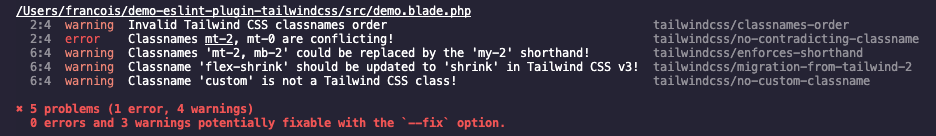
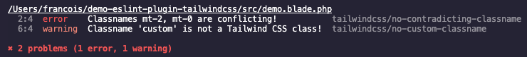

# `eslint-plugin-tailwindcss` with `*.blade.php` files

Demonstrating how `eslint-plugin-tailwindcss` works for you with blade

1. clone this repo
2. `npm i`
3. `npm run lint` will parse `src/demo.blade.php` and it should report 5 errors (one for each existing rule)
  
4. `npm run lint-fix` will fix what it can and you should get 2 remaining errors
  
